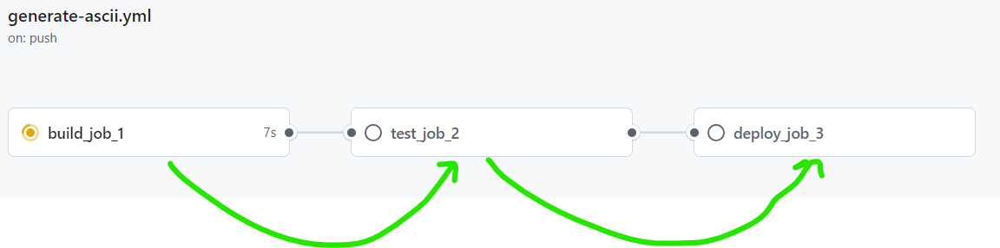

# Exploring GitHub Actions

- By Default actions are running on another machine that has no access to our github directory
- The pipe used to run a sequence of cmds ( | )
- In order to execute a shell script within your workflow, verify that the script have permission to be executed
- Using the github runner each job is run on a separate VM
    - A default behavior is that all jobs runs on parallel and do not depend one on another
    - Use **needs** to identify any jobs that must complete successfully before this job will run

- If needs is used and one job depends on another, if one fails the next one will be skipped

- By default Files are not shared between jobs
    - So we need yo use **artifacts** to upload a files from a job to another and than download it whare we need it.
