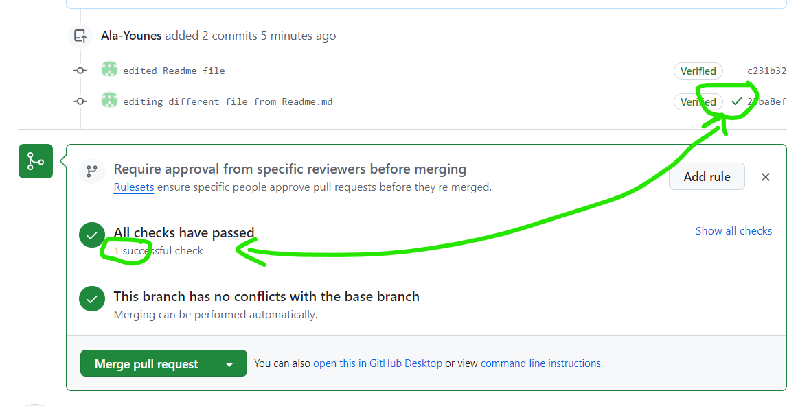
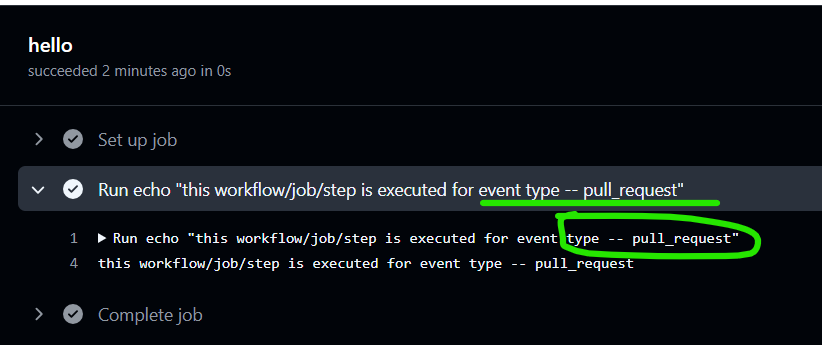

# Exploring GitHub Actions

- By Default actions are running on another machine that has no access to our github directory
- The pipe used to run a sequence of cmds ( | )
- In order to execute a shell script within your workflow, verify that the script have permission to be executed
- Using the github runner each job is run on a separate VM
    - A default behavior is that all jobs runs on parallel and do not depend one on another
    - Use **needs** to identify any jobs that must complete successfully before this job will run

- If needs is used and one job depends on another, if one fails the next one will be skipped

- By default Files are not shared between jobs
    - So we need yo use **artifacts** to upload a files from a job to another and than download it whare we need it. [Upload](https://github.com/marketplace/actions/upload-a-build-artifact)! [Download](https://github.com/marketplace/actions/download-a-build-artifact)!

- Artifact and log retention by default is 90days, can be changed (Settings -> Actions -> Retention days)

### We can define envirenment variables on three levels (Step level, Job level and Workflow level)

### We can trigger our workflow using many triggers for example : 

### Without concurrency if a workflow is stuck and we need to run another one than the first will always keep running -> We will loose time (2000 minutes free ...)

- If concurrency  = false workflow triggered after the other will wait for the first one in order to be completed:

**Important** Sometimes we can have memory or timeout problems so we may need to add timeout-minut that way we are sure our workflow does not take infinity time

### A default behavior on the matrix strategy, if a job failes the other ones will stop running.
- For example we know that alpine does not work on windows, so can exclude it from the matrix
- User defines the key values as he wants, we can also define how many jobs on parallel and if a job fails continue or not.

### In this example we will see how to trigger a github action (pull request + modifying different file from README.md)

### There are multiple ways to skip the CI workflow
[Skipping the CI by putting in the commit message the good msg](https://docs.github.com/en/actions/managing-workflow-runs-and-deployments/managing-workflow-runs/skipping-workflow-runs) !!
